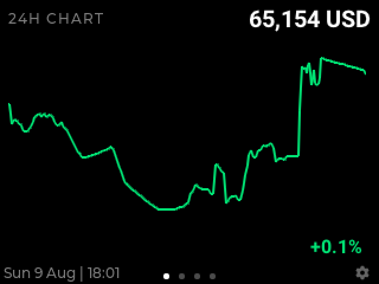

# ZapTV! &amp; BlockTV!

**Bitcoin television, on your desk.** Two apps for [MicroPythonOS](https://micropythonos.com) that turn a $20 pocket-sized screen into an always-on Bitcoin display. From [ZapTV.org](https://www.zaptv.org).

| | |
|---|---|
|  |  |
| **ZapTV!** watches your zaps | **BlockTV!** watches the network |

## ZapTV! (`org.zaptv.app`)

The first Nostr-native app on MicroPythonOS: a Lightning zap display built around zaps, not balances.

- **Scan your npub** and your Nostr profile picture, name, and npub.cash Lightning address appear automatically, with a receive QR on screen
- **Connect any wallet**: LNbits, Nostr Wallet Connect, or a watch-only on-chain xpub via any Blockbook instance (self-hosted included)
- **Every zap strikes like lightning**: a 6-second full-screen storm, then the new transaction blinks for 30 seconds
- **Your feed, your rules**: show 1 to 21 recent transactions, sorted by newest or largest; zap comments render with full emoji support
- **Safe in public**: display-only, no keys held, no balance shown, xpubs redacted from logs

## BlockTV! (`org.zaptv.blocktv`)

A fully customisable Bitcoin dashboard: compose your own pages from sixteen data fields and let the numbers roll odometer-style.

- **The data**: block height, spot price in 7 currencies, moscow time, fees three ways, halving countdown, supply, market cap, clock
- **Honest charts** from 24 hours to a full 4-year halving cycle: every point is a real market sample, stale data shades orange then red, outages are back-filled and never drawn flat
- **Your layout**: one huge number or up to eight tiles per page, unlimited pages, drag to reorder, your own colours
- **Bitcoin-native extras**: latest zap via your npub, wallet balance over NWC, optional flash on every new block
- **Built like an appliance**: instant restarts with last-known values, self-hosted mempool support for privacy

## What you need

| | |
|---|---|
| **Board** | ESP32-S3 with a 320&times;240 display (e.g. Waveshare ESP32-S3 Touch LCD 2) |
| **Touch** | Optional; both apps run keypad-only |
| **Network** | WiFi, 2.4 GHz |
| **Cost** | Roughly $15 to $25 all-in |

## How to run it

1. **Flash MicroPythonOS from your browser** at [install.micropythonos.com](https://install.micropythonos.com). No toolchain, no terminal.
2. **Join your WiFi** on the device at first boot.
3. **Install both apps** from the on-device app store. Updates arrive over the air.

## Links

- Website: [www.ZapTV.org](https://www.zaptv.org)
- Source: [github.com/bitcoin3us/ZapTV](https://github.com/bitcoin3us/ZapTV) (MIT)
- App store: [apps.micropythonos.com](https://apps.micropythonos.com)
- The OS: [micropythonos.com](https://www.micropythonos.com)

*Both apps are display-only: they hold no keys, move no funds, and give no financial advice. They just show you the state of Bitcoin, honestly.*
