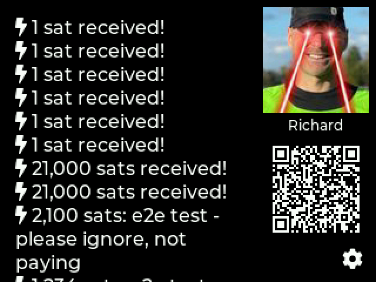
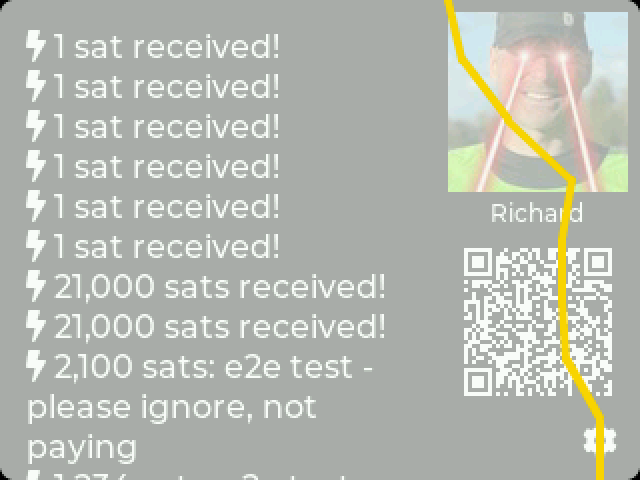

# ZapTV

**Your zaps, live on your desk.**

ZapTV is the first Nostr-native app for [MicroPythonOS](https://micropythonos.com): a dedicated Lightning zap display that turns any MPOS device into a little TV for your sats. Scan your npub, set it on your desk, shelf, or merch table, and watch zaps roll in with a full-screen lightning strike every time one lands.

Where other balance displays stop at "how much", ZapTV is built for the social layer of Lightning: it knows who you are on Nostr, shows your profile, renders zap comments with full emoji support, and gives everyone in the room a QR code to zap you on the spot.

Learn more at [www.ZapTV.org](https://www.zaptv.org).

*Captured on real hardware: a Waveshare ESP32-S3 Touch LCD running MicroPythonOS.*

## What it does

Connect a wallet, scan your npub, and ZapTV continuously displays your most recent incoming zaps and payments alongside your Nostr profile picture and a scannable receive QR. New transactions announce themselves with a 6-second lightning storm across the whole screen, then keep blinking in the list for 30 seconds so nobody misses them. No balance is shown, so it is safe to leave running in public.

## Features

### Nostr-native
- Scan your npub with the built-in camera and ZapTV fetches your Nostr profile automatically
- Your profile picture and name displayed on screen
- Your npub.cash Lightning address derived automatically and shown as a receive QR
- Zap comments rendered with full emoji support, including the ⚡ everyone actually sends

### Works with your wallet
- **LNbits**: point it at your instance and API key
- **Nostr Wallet Connect (NWC)**: works with Alby, coinos, and any NWC-capable wallet
- **On-chain (xpub)**: watch-only via any Blockbook instance, including self-hosted (Umbrel, Start9, BTCPay Server), with automatic receive-address rotation after each payment
- Per-wallet slots remember credentials and cache transactions, so switching wallets is instant and the screen is never empty at boot

### Made to be watched

- Full-screen lightning strike effect when a new transaction arrives
- New transactions blink for 30 seconds
- Show 1 to 21 recent transactions, your choice
- Sort by most recent or by largest amount
- Tap the QR to enlarge it full screen for easy scanning across the table

- Dark mode with a properly inverted QR code
- Amounts in sats or with the ₿ symbol, formatted with your regional number style

### Privacy-aware
- Display-only: ZapTV never holds keys and cannot move funds
- No balance on screen, safe for public spaces
- xpubs are redacted from logs and error messages

### At home on any MPOS device
- Runs on touch and non-touch devices alike, fully navigable by keypad
- Iterated and tested on real hardware (Waveshare ESP32-S3 Touch LCD)
- About screen with app version, MPOS version, and hardware info

## A first for MicroPythonOS

ZapTV is the first app of its kind on MPOS: the first to speak Nostr, the first built around zaps rather than balances, and the first designed as an ambient social display instead of a personal dashboard. If you stream, sell, speak, or just like the sound of thunder when sats arrive, this is the app your device was waiting for.

**Get it from the MPOS app store, or install over the air from [www.ZapTV.org](https://www.zaptv.org).**
